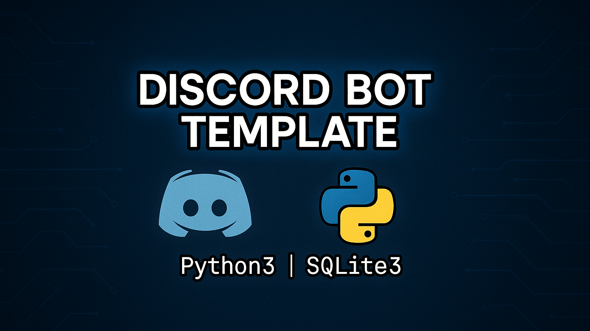

# Discord Bot Template

<p align="center">
  
  
  
</p>



> A modular template for easy expansion and management of commands and events.

## ✨ Features

- Clean and modular structure.
- Register command (register username and user_id on database).
- Ping command (checks bot latency).
- Example events: Message filter and greeting the bot.

## ⚙️ Requirements

- Python3
- discord.py

## 🚀 How to Run

1. Install requirements.
``` bash
    pip install -r requirements.txt
```
2. Rename config.example.json to config.json.
3. Add your bot token in the designated field.
4. (optional) Change the bot prefix of your choice.
5. Run the bot!
``` bash
    python3 src/bot/main.py 
```

## 📝 License

Licensed under the [MIT License](LICENSE).